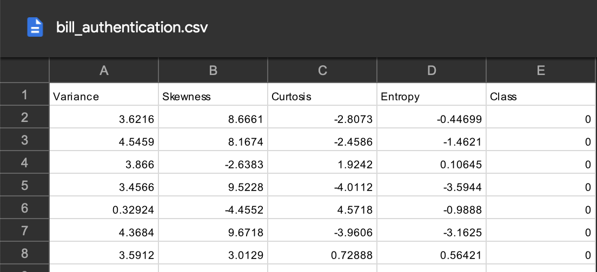

This project demonstates two datasets in which different kernels are adopted

Built SVM model with 3 different kernels to classify class of Iris flower and determined the best kernel (polynomial) that lead to 100% accuracy for the dataset with 150 samples. 

# Simple SVM (linear problem)

The task is to predict whether a bank currency note is authentic or not based on four attributes of the note.
i.e. skewness of the wavelet transformed image, variance of the image, entropy of the image, and curtosis of the image. 
This is a binary classification problem and will use SVM algorithm to solve this problem.

 

# Kernel SVM (non linear)
In the case of non-linearly separable data, a straight line cannot be used as a decision boundary. That's wht kernel is used.

Basically, the kernel SVM projects the non-linearly separable data lower dimensions to linearly separable data in higher dimensions in such a way that data points belonging to different classes are allocated to different dimensions.

The task is use the famous iris dataset to predict the category to which a plant belongs based on four attributes: sepal-width, sepal-length, petal-width and petal-length.

The steps of training a model, making predictions, evaluating the model of the following kernels:
- Polynomial Kernel, 
- Gaussian Kernel,
- Sigmoid Kernel
are processed to see which one results in best performance.

**Conclusion:**

Comparing the performance of the different types of kernels, it is clear that the sigmoid kernel performs the worst. This is due to the reason that sigmoid function returns two values, 0 and 1, therefore it is more suitable for binary classification problems. However, in this Iris dataset case, there are three output classes.

Amongst the Gaussian kernel and polynomial kernel, we can see that polynomial kernel achieved a perfect 100% prediction rate while Gaussian kernel misclassified 2 instances. Therefore the polynomial kernel performed slightly better.
